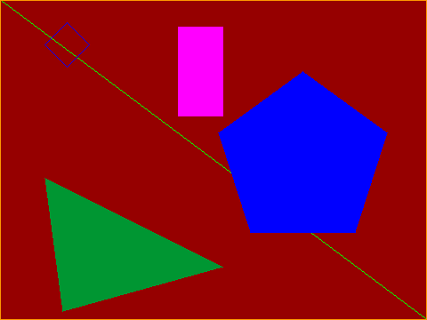

# `juicy-draw`

[](https://travis-ci.org/rcook/juicy-draw)
[](http://hackage.haskell.org/package/juicy-draw)
[](https://raw.githubusercontent.com/rcook/juicy-draw/master/LICENSE)

Functions for drawing and filling lines, rectangles and polygons directly onto a [JuicyPixels][juicypixels] mutable image; inspired by [JuicyPixels-canvas][juicypixels-canvas] but without the `Canvas` part

## Example



See [code][example-code].

## Set up dev tools

This project can be built using the [Stack][stack] build tool.

```bash
stack build intero
stack build --copy-compiler-tool ghcid
```

## ghcid

```bash
stack exec ghcid -- -T':main'
```

## Build

```bash
stack build
```

## Test

```bash
stack test
```

## Run demo

```bash
stack exec juicy-draw-demo
```

## Upload package

```
stack upload .
```

## Upload documentation

I use my [`upload-haddocks`][upload-haddocks] tool which requires a functioning installation of Python and pip:

```
pip install --user upload-haddocks
upload-haddocks
```

## Releases

[View change log for more information][change-log]

## Licence

[MIT License][licence]

Copyright &copy; 2018, Richard Cook.

[change-log]: CHANGELOG.md
[example-code]: app/Main.hs
[juicypixels]: https://hackage.haskell.org/package/JuicyPixels
[juicypixels-canvas]: https://hackage.haskell.org/package/JuicyPixels-canvas
[licence]: LICENSE
[stack]: http://haskellstack.org/
[upload-haddocks]: https://github.com/rcook/upload-haddocks
